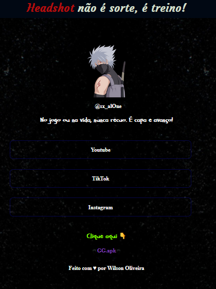

<h1 align="center"> Theus FF #Theus na Mira </h1>

Jogadores que querem se destacar de forma mais profissional.

  <a href="#-tecnologias">Tecnologias</a>&nbsp;&nbsp;&nbsp;|&nbsp;&nbsp;&nbsp;
  <a href="#-projeto">Projeto</a>&nbsp;&nbsp;&nbsp;|&nbsp;&nbsp;&nbsp;
  

  

 

  

## 🚀 Tecnologias

Esse projeto foi desenvolvido com as seguintes tecnologias:

- HTML e CSS
- Git e Github

## 💻 Projeto

Este é um site simples e objetivo criado para representar a presença online do jogador **Theus FF**, com foco em **divulgar suas redes sociais** e trazer uma imagem **mais profissional** no cenário competitivo de Free Fire.

## 🔖 Licença

Esse projeto está sob a licença MIT....